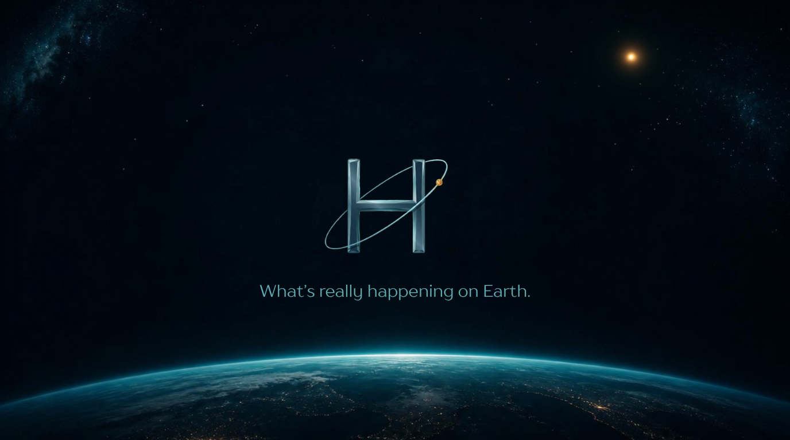

<div align="center">


# 🛰️ HELM

### Planetary Intelligence from Orbit

**A satellite Earth-observation intelligence platform that turns the firehose of space data into decisions.**

*Ask a question in plain language → HELM pulls multi-mission satellite signals → discovers a non-obvious cross-domain link (the **Blind Spot**) → explains the cause, effect, and action on an interactive mission-control globe.*

<br/>


**Built for the [IBM "Advance Space Exploration with AI"](https://www.ibm.com/granite) challenge · Reasoning on IBM Granite (watsonx.ai)**

<br/>



</div>

---

## The problem

Space agencies and Earth-observation missions downlink **staggering volumes** of satellite telemetry, imagery, and sensor data every day. Yet the brief for this challenge says it plainly: *"Despite vast amounts of available telemetry, satellite imagery, and sensor data, extracting actionable insights remains difficult."*

The bottleneck isn't the data — it's **interpretation**. Rainfall, aerosols, soil moisture, and thermal anomalies each live in a separate satellite feed, in a separate dashboard, read by a separate specialist. The connections *between* those feeds — the ones that actually explain an event — stay invisible. Space is **data-heavy but insight-poor**.

## The solution

**HELM** is a satellite data-analysis and decision-support platform. You ask a question a human would ask — *"Why is there flooding in the Philippines?"* — and HELM:

1. **Resolves** the question to a place on Earth (gazetteer + live geocoding — ask about *any* region).
2. **Ingests** multiple satellite-derived signals for that region and time window.
3. **Discovers** cross-domain links with a deterministic engine (lagged cross-correlation + anomaly co-occurrence) — this is where the **Blind Spot** comes from: a connection nobody was looking at.
4. **Reasons** over *only those discovered links* with **IBM Granite**, producing a plain-language cause → mechanism → effect chain, concrete effects, and recommended actions.
5. **Visualizes** it as an animated flight from orbit down to the region on a real-satellite-imagery globe, arcs tracing the discovered connections.

The headline output is the **Blind Spot** — the surprising, cross-domain link the discovery engine surfaces that a single-feed analyst would miss.

## Why this fits "Advance Space Exploration with AI"

HELM is a direct match for the challenge's own example solution areas:

- ✅ **Satellite data analysis platform**
- ✅ **Tools that translate complex space data into clear insights**
- ✅ **Space operations & decision-support systems**
- ✅ **Space education & public engagement** — anyone can ask a question and understand orbital data

It answers the challenge's core question — *"How can AI transform space exploration from data-heavy to insight-driven systems?"* — as its entire reason for existing.

## Architecture — the hybrid brain

HELM deliberately splits discovery from reasoning so the AI **cannot invent connections** — it may only explain links the deterministic engine actually found. This grounding is what makes the output trustworthy for decision support.

```
  Question
     │
     ▼
 ┌─────────────┐   place        ┌──────────────────┐  satellite-derived signals
 │  Geocoding  │ ─────────────▶ │  Ingestion       │  rainfall · soil moisture
 │ (gazetteer  │                │  (multi-mission) │  temperature · PM2.5 · AOD
 │  + live)    │                └────────┬─────────┘  · natural-event feeds
 └─────────────┘                         │
                                         ▼
                         ┌───────────────────────────────┐
                         │  Discovery Engine (deterministic)│
                         │  lagged cross-correlation +      │
                         │  anomaly co-occurrence  →  ranked│
                         │  candidate links  →  the Blind Spot│
                         └───────────────┬──────────────────┘
                                         │ discovered links ONLY
                                         ▼
                         ┌───────────────────────────────┐
                         │  Reasoning (IBM Granite / watsonx)│
                         │  grounded: explains only found   │
                         │  links → cause/effect/action JSON│
                         └───────────────┬──────────────────┘
                                         ▼
                         ┌───────────────────────────────┐
                         │  Mission-control globe (MapLibre │
                         │  + real satellite imagery + arcs)│
                         └───────────────────────────────┘
```

If the live model or network is unavailable, HELM degrades gracefully to a bundled analysis fixture, so the interface always renders.

## Data — signals from orbit

HELM's signals are derived from real Earth-observation missions and reanalyses (accessed via open analysis-ready APIs, so no raw-imagery pipeline is required):

| Signal | Originating mission / product |
| --- | --- |
| Rainfall | **GPM / IMERG** (precipitation) |
| Soil moisture | **SMAP / Sentinel-1** (derived) |
| Temperature | **ERA5** (satellite-assimilated reanalysis) |
| Aerosols · PM2.5 | **Sentinel-5P TROPOMI / CAMS** |
| Natural events | **NASA EONET** |
| Basemap imagery | **Esri World Imagery** (Maxar, Sentinel-2, Landsat) |

*Data via Open-Meteo (archive & air-quality) and NASA EONET. Basemap © Esri, Maxar, Earthstar Geographics.*

## AI & IBM stack

- **Reasoning model:** IBM **Granite 4.0 H Small**, hosted on **watsonx.ai** (`text/chat`), called through a local proxy that keeps the API key server-side and performs IAM token exchange.
- **Grounding:** Granite receives only the discovery engine's ranked links and must return strict JSON conforming to a single contract — it cannot fabricate connections.

> **IBM Bob:** _<!-- Fill in truthfully: the specific screen(s)/logic you built or iterated inside IBM Bob, with a screenshot or session reference. Keep this to what actually happened. -->_

## Tech stack

React 19 · TypeScript · Vite 6 · Tailwind v4 · MapLibre GL + deck.gl (satellite globe + arcs) · IBM Granite on watsonx.ai · Open-Meteo / NASA EONET data.

## Run locally

**Prerequisites:** Node.js 18+

```bash
npm install
```

Create a `.env.local` in the project root:

```bash
# IBM watsonx.ai — server-side only (never shipped to the browser)
WATSONX_API_KEY=your_ibm_cloud_api_key
WATSONX_PROJECT_ID=your_watsonx_project_id
WATSONX_URL=https://us-south.ml.cloud.ibm.com
WATSONX_MODEL_ID=ibm/granite-4-h-small
# Browser flag only — enables live reasoning (not a secret)
VITE_GRANITE_ENABLED=true
```

Then:

```bash
npm run dev      # http://localhost:3000
```

Ask *"Why is there flooding in the Philippines?"* — or any region on Earth.

> **Offline / demo mode:** leave `VITE_GRANITE_ENABLED` unset and HELM runs on a bundled analysis fixture — the globe, Blind Spot, and briefing all still render without any credentials.

## Project layout

```
src/
  brain/               # the hybrid brain (framework-agnostic)
    contracts.ts       # single source of truth for all types
    geo.ts             # question → region (gazetteer + live geocoding)
    ingestion.ts       # region → satellite-derived signals
    discovery.ts       # deterministic cross-domain link discovery
    reasoning.ts       # grounded Granite synthesis → Analysis
    llm/client.ts      # Granite transport (via /api/granite proxy)
    __fixtures__/      # offline fallback analysis
  components/
    RealMapView.tsx    # MapLibre satellite globe + deck.gl arcs
    InvestigationsView.tsx
vite.config.ts         # includes the server-side Granite proxy plugin
docs/                  # phase specs & architecture notes
```
